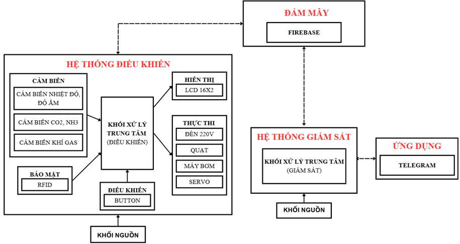
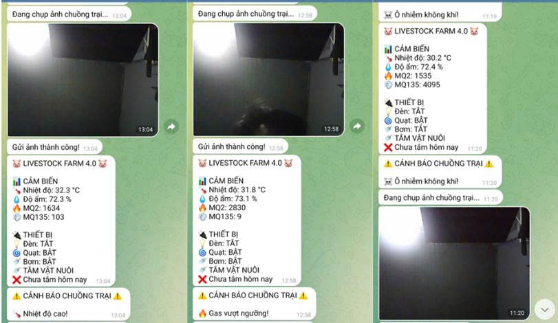
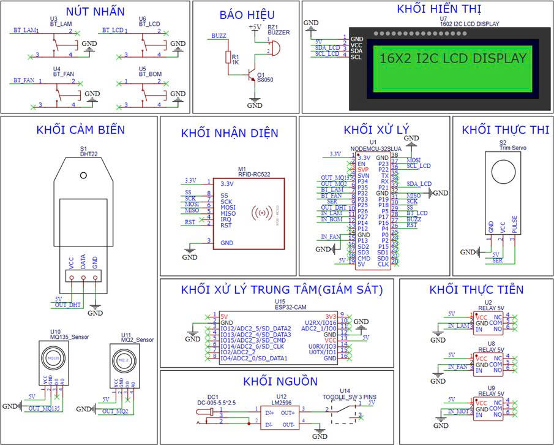
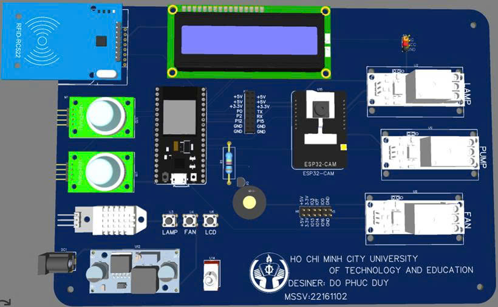

# livestock Farm - Hệ thống giám sát và điều khiển môi trường chuồng trại chăn nuôi heo thông minh

**ESP32 Pig Farm**

---

## Giới thiệu

Livestock Farm là đồ án xây dựng hệ thống giám sát và điều khiển môi
trường chuồng trại chăn nuôi heo thông minh dựa trên vi điều khiển
**ESP32** kết hợp công nghệ **IoT**.

### 🎯 Mục tiêu chính

- Tự động hóa việc giám sát nhiệt độ, độ ẩm, khí gas dễ cháy và khí amoniac (NH₃)
- Xử lý khẩn cấp khi môi trường bất thường
- Thực hiện tắm tự động theo lịch
- Hiển thị thông tin tại chỗ và đồng bộ dữ liệu lên đám mây để theo dõi từ xa

---

## 🚀 Tính năng chính

### 🔎 Giám sát môi trường realtime

- **DHT22** — đo nhiệt độ, độ ẩm
- **MQ2** — phát hiện khí gas dễ cháy, khói
- **MQ135** — phát hiện NH₃ và khí độc
- Hỗ trợ **hiệu chuẩn baseline tự động**

### 🚨 Cảnh báo & xử lý khẩn cấp

- Buzzer + nhấp nháy LCD
- Tự động bật quạt, phun sương (bơm)
- Duy trì hoạt động thêm **5 phút** sau khi ổn định

### ⚙️ Điều khiển tự động & thủ công

- Tắm phun sương tự động **16:30 / 15 phút**
- Điều khiển thủ công quạt, đèn bằng nút bấm

### 📟 Hiển thị tại chỗ

- LCD 16x2 — 8 trang hiển thị

### ☁️ Kết nối đám mây

- Firebase Realtime Database (mỗi 10 giây)

---

## 📩 Gửi cảnh báo qua Telegram

Hệ thống gửi cảnh báo thời gian thực khi vượt ngưỡng hoặc có sự kiện quan trọng.

### 🔐 An ninh truy cập

- **RFID MFRC522**
- Servo điều khiển cửa

---

## 🛠 Cấu trúc phần cứng

- ESP32 NodeMCU-32S
- Cảm biến: DHT22, MQ2, MQ135
- Relay — quạt, đèn, bơm
- LCD 16x2 I2C
- RFID MFRC522
- WiFi (NTP + Firebase)

---

## 💻 Phần mềm

**Ngôn ngữ:** Arduino C++

### 📚 Thư viện

- ESP32Servo
- DHT sensor library
- MFRC522
- LiquidCrystal_I2C
- Firebase-ESP-Client
- NTPClient

---

## ✅ Kết quả

- Cảnh báo chính xác
- Điều khiển ổn định
- Đồng bộ Firebase tốt
- RFID + servo an toàn

---

## ⚠️ Hạn chế & 🔮 Hướng phát triển

### Hạn chế

- Chưa có camera AI
- Chưa có app/dashboard
- Cửa tự động tạm bỏ

### Hướng phát triển

- ESP32-CAM + AI
- Dashboard / App
- Năng lượng mặt trời + LoRa

---

Pig Farm 4.0 — **Nông nghiệp 4.0** 🐷🌾

**Tác giả:** Đỗ Phúc Duy  
**Trường:** Đại học Sư phạm Kỹ thuật TP.HCM  
**Email:** dophucduy3@gmail.com
